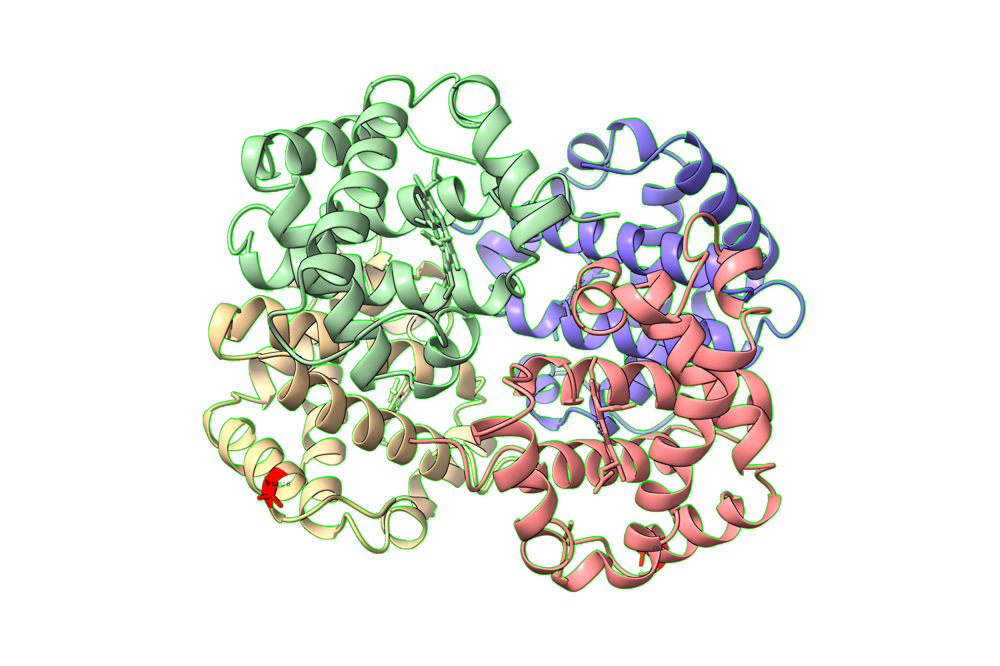
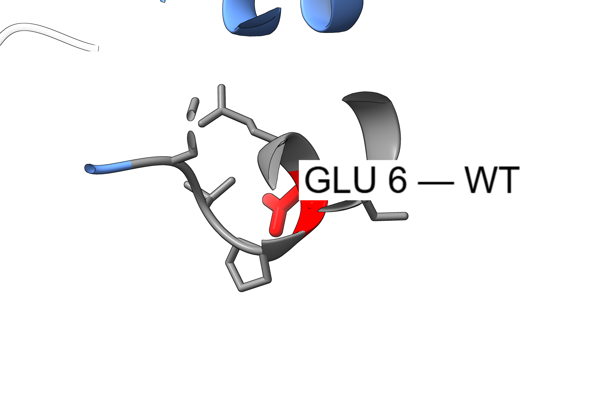
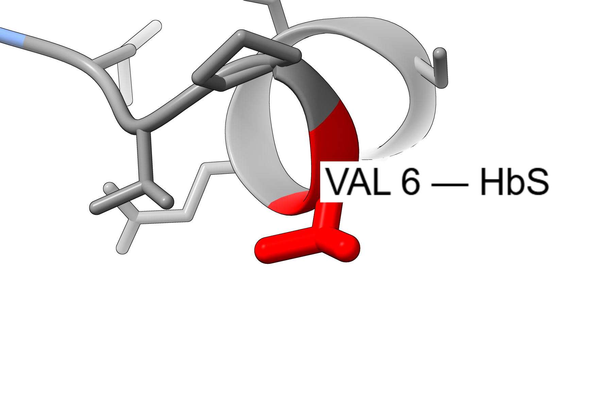
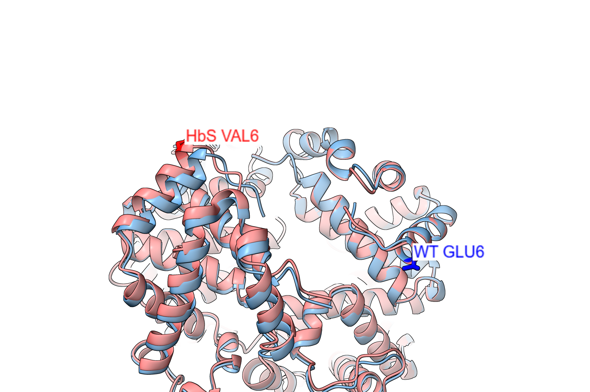
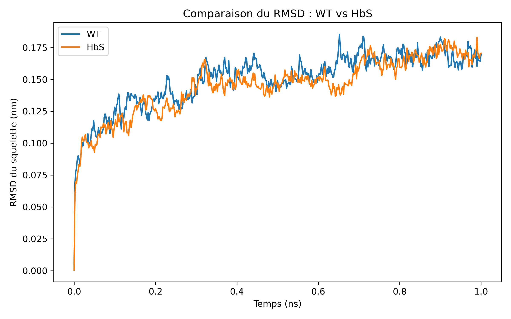
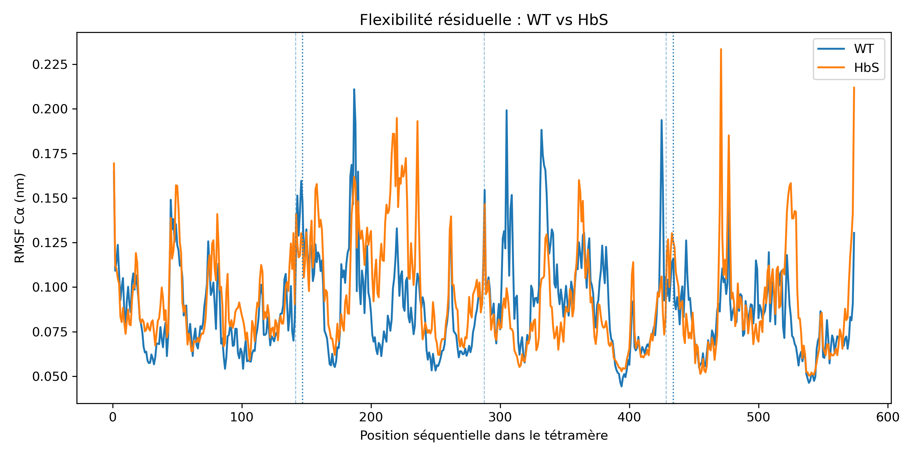
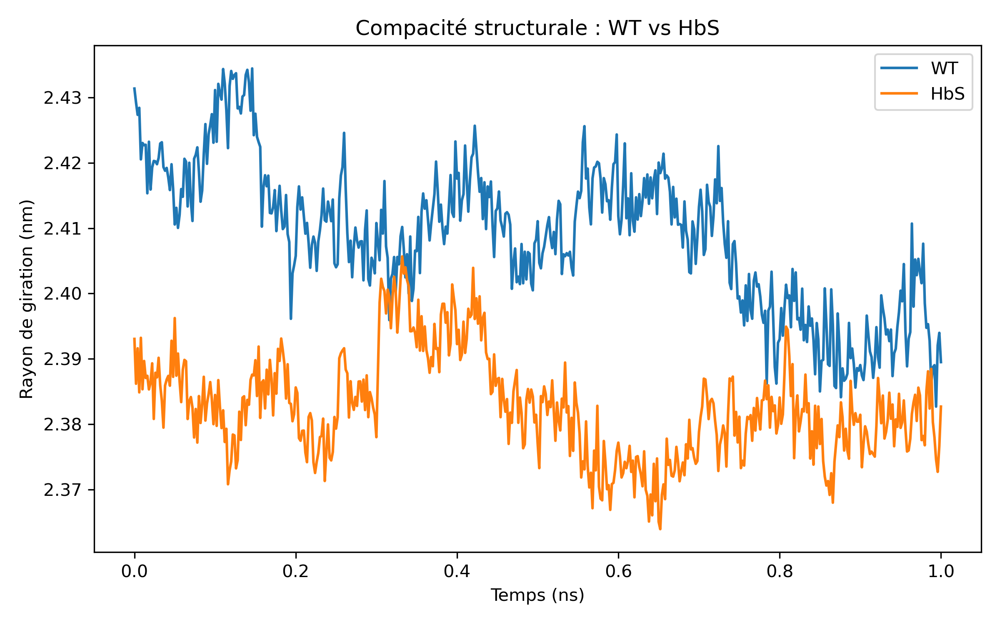

# HBB_MD_Interpretation

## Travail Pratique de Bioinformatique

**Sujet :** *Amélioration de l'interprétation de variants génétique par l'intégration de structure 3D de protéine et de données de dynamique moléculaire*

**Cas d'étude :** *Comparaison de l'hémoglobine normale (WT) et de l'hémoglobine S (HbS)*

Université de Kinshasa - Faculté des Sciences et Technologies - Département de Mathématiques, Statistique et Informatique - Master 2.

**Titulaire :** Professeur Christian D. BOPE  
**Doctorant :** Keph Makoy

**Membres du groupe :**
- Makwiza Mbala Judicael
- Matendo Kalaki Donat
- Mwanza Parousia Ketsia
- Mfushi Kapalay Stephen
- Luayi Kangombo Jonas

---

## 1. Contexte biologique

L'hémoglobine adulte est un tétramère `α2β2` contenant quatre groupes hème. Le gène **HBB** code la chaîne β. Le variant **NM_000518.5(HBB):c.20A>T** produit l'hémoglobine S (**HbS**) et correspond à **p.Glu7Val** dans la numérotation incluant la méthionine initiatrice, ou **βGlu6Val** dans la numérotation classique de la chaîne β mature. Il est référencé notamment par **rs334**.

Le remplacement d'un glutamate chargé par une valine hydrophobe modifie localement la surface de la chaîne β. En condition désoxygénée, cette modification favorise des contacts entre molécules HbS et leur polymérisation, mécanisme central de la drépanocytose.

<p align="center">
  
</p>
<p align="center"><em>Hémoglobine WT visualisée avec ChimeraX : quatre chaînes et quatre groupes hème.</em></p>

---

## 2. Problématique, hypothèse et objectifs

### Problématique

Dans quelle mesure l'intégration de l'annotation clinique, de structures 3D expérimentales et de métriques issues d'une dynamique moléculaire permet-elle de mieux interpréter l'impact structural du variant **HBB βGlu6Val** ?

### Hypothèse

La substitution **Glu → Val** peut produire des différences mesurables de dynamique et de compacité. Sur un tétramère isolé, ces différences devraient rester modestes si le mécanisme pathogène dépend surtout des interactions **intermoléculaires**.

### Objectifs

1. Documenter le variant HBB étudié et son contexte clinique.
2. Comparer les structures 3D WT et HbS.
3. Préparer et simuler les deux modèles moléculaires dans des conditions comparables.
4. Quantifier la stabilité globale, la flexibilité résiduelle et la compacité par **RMSD**, **RMSF** et **rayon de giration (Rg)**.
5. Relier les observations structurales à l'interprétation biologique du variant.

---

## 3. Visualisation 3D du variant

<table>
<tr>
<td align="center"><br/><b>WT : GLU6</b></td>
<td align="center"><br/><b>HbS : VAL6</b></td>
</tr>
</table>

<p align="center">
  
</p>
<p align="center"><em>Superposition WT/HbS : la substitution est localisée et les architectures globales restent proches.</em></p>

Les figures ChimeraX servent à visualiser directement la substitution **βGlu6Val** et à relier l'annotation génétique aux résultats de dynamique moléculaire.

---

## 4. Structures expérimentales

| Modèle | PDB | Description | Résolution |
|---|---|---|---:|
| WT | **2DN2** | Hémoglobine humaine désoxygénée | 1.25 Å |
| HbS | **2HBS** | Désoxyhémoglobine S | 2.05 Å |

Pour la comparaison, les chaînes **A, B, C et D** et les quatre groupes **HEM** ont été conservés.

> **Limite importante :** WT et HbS proviennent de deux structures cristallographiques différentes. Les écarts observés ne peuvent donc pas être attribués exclusivement à la mutation.

---

## 5. Pipeline de calcul

```text
Variant HBB / ClinVar
        ↓
Structures PDB WT (2DN2) et HbS (2HBS)
        ↓
Nettoyage : chaînes A-D + quatre hèmes
        ↓
pdb2gmx + topologie locale GROMOS54A7_hbb
        ↓
Boîte commune + solvatation SPC + NaCl 0.15 M
        ↓
Minimisation énergétique
        ↓
NVT 100 ps
        ↓
NPT avec contraintes 300 ps
        ↓
NPT libre 200 ps
        ↓
Production pilote 1 ns
        ↓
RMSD / RMSF / rayon de giration
        ↓
Interprétation + visualisation ChimeraX
```

### Pourquoi ces étapes ?

- **Minimisation énergétique :** éliminer les contacts atomiques défavorables avant la dynamique.
- **NVT :** stabiliser la température à 300 K.
- **NPT :** ajuster pression et densité dans l'environnement aqueux.
- **NPT libre :** retirer les contraintes de position avant l'analyse de la dynamique propre de la protéine.
- **Production :** générer la trajectoire analysée pour WT et HbS.

---

## 6. Préparation et validation

### Outils et paramètres principaux

| Élément | Choix |
|---|---|
| GROMACS | 2023.3 |
| Champ de force | `GROMOS54A7_hbb` |
| Eau | SPC |
| Boîte | Dodécaédrique, volume commun 682.654 nm³ |
| Sel | NaCl 0.15 M |
| Thermostat | V-rescale |
| Barostat | C-rescale |
| Production | 1 ns par modèle |

Un correctif local, documenté dans le dépôt, réutilise le terme d'angle GROMOS approprié pour la géométrie **C-NR-FE** associée aux histidines proximales des hèmes. Il s'agit d'un correctif de compatibilité local, pas d'une nouvelle paramétrisation complète de l'hème.

### Contrôles réalisés

- quatre groupes hème présents pour WT et HbS ;
- quatre interactions proximales His-Fe prises en compte ;
- aucun `No default G96Angle types` après le correctif local ;
- structures neutralisées après ajout d'ions ;
- aucun **LINCS warning** pendant NVT, NPT et production ;
- aucun nouveau warning `grompp` accepté en dehors de l'avertissement GROMOS connu.

| Modèle | Atomes après ions | Eaux | Ions ajoutés |
|---|---:|---:|---|
| WT | 65 571 | 19 879 | 68 Na+, 62 Cl- |
| HbS | 65 415 | 19 829 | 66 Na+, 62 Cl- |

---

## 7. Équilibration et stabilité thermodynamique

### Minimisation

- **WT :** convergence en 523 étapes ; Fmax = **959.85 kJ mol⁻¹ nm⁻¹**.
- **HbS :** convergence en 552 étapes ; Fmax = **943.06 kJ mol⁻¹ nm⁻¹**.

### Production 1 ns

| Métrique | WT | HbS |
|---|---:|---:|
| Température | 299.94 ± 1.26 K | 299.88 ± 1.31 K |
| Pression | 0.32 ± 106.81 bar | -0.01 ± 102.22 bar |
| Densité | 1017.59 ± 1.90 kg/m³ | 1016.93 ± 1.87 kg/m³ |

Les températures et densités restent stables et très proches. Les fluctuations instantanées de pression sont importantes, ce qui est courant pour une boîte atomistique de cette taille ; les moyennes restent proches de la pression cible.

---

## 8. Résultats structuraux

### 8.1 RMSD - stabilité globale

<p align="center">
  
</p>

- **WT :** 0.1581 ± 0.0122 nm sur 0.2-1 ns.
- **HbS :** 0.1533 ± 0.0140 nm sur 0.2-1 ns.
- **Δ HbS-WT :** -0.0048 nm.

**Lecture :** les deux modèles ont une stabilité globale très proche ; aucune déstabilisation globale majeure de HbS n'est visible sur 1 ns.

### 8.2 RMSF - flexibilité résiduelle

<p align="center">
  
</p>

| RMSF | WT | HbS |
|---|---:|---:|
| Cα moyen | 0.0882 nm | 0.0932 nm |
| β6 moyen | 0.1320 nm | 0.1258 nm |
| Voisinage β6 ±5 | 0.1144 nm | 0.1164 nm |

**Lecture :** HbS présente une flexibilité globale légèrement supérieure, mais la position β6 ne devient pas nettement plus mobile dans HbS.

### 8.3 Rayon de giration - compacité

<p align="center">
  
</p>

- **WT :** 2.4059 ± 0.0096 nm.
- **HbS :** 2.3821 ± 0.0083 nm.
- **Δ HbS-WT :** -0.0238 nm.

**Lecture :** HbS est légèrement plus compacte, mais la différence reste faible.

### Tableau récapitulatif

| Métrique | WT | HbS | Δ HbS-WT |
|---|---:|---:|---:|
| RMSD backbone moyen | 0.1581 ± 0.0122 nm | 0.1533 ± 0.0140 nm | -0.0048 nm |
| RMSF Cα moyen | 0.0882 nm | 0.0932 nm | +0.0050 nm |
| RMSF β6 moyen | 0.1320 nm | 0.1258 nm | -0.0061 nm |
| Voisinage β6 ±5 | 0.1144 nm | 0.1164 nm | +0.0020 nm |
| Rayon de giration moyen | 2.4059 ± 0.0096 nm | 2.3821 ± 0.0083 nm | -0.0238 nm |

---

## 9. Interprétation

Sur cette dynamique moléculaire pilote de **1 ns**, les tétramères WT et HbS restent globalement stables et proches. La mutation **βGlu6Val** ne produit pas de déstabilisation globale majeure du tétramère isolé dans les conditions simulées.

Les résultats sont compatibles avec un mécanisme dans lequel l'effet pathogène majeur de HbS dépend surtout de **contacts intermoléculaires** et de la **polymérisation** favorisés par la valine hydrophobe en position β6, plutôt que d'une simple perte de stabilité globale de la molécule isolée.

Cette conclusion doit rester prudente : la simulation ne contient pas une fibre HbS et ne permet pas d'estimer directement une énergie libre de polymérisation ou un ΔG de mutation.

---

## 10. Limites

- durée de production courte : **1 ns par modèle** ;
- structures initiales WT et HbS provenant de deux cristaux expérimentaux différents ;
- tétramère isolé, sans simulation directe de la polymérisation HbS ;
- champ de force GROMOS utilisé avec un correctif local documenté et l'avertissement historique GROMOS signalé par GROMACS 2023.3 ;
- les résultats ne constituent pas une estimation de **ΔG**.

---

## 11. Organisation du dépôt

```text
HBB_MD_Interpretation/
├── data/                         # PDB bruts et structures préparées
├── docs/                         # Présentation Beamer/PDF et notes de publication
├── figures/                      # Graphiques RMSD/RMSF/Rg
├── mdp/                          # Paramètres GROMACS
├── presentation_assets/         # Visualisations ChimeraX et assets Beamer
├── results/analysis/             # Métriques finales et sorties numériques utiles
├── scripts/                      # Scripts Python/Bash
├── tests/                        # Contrôles de préparation
└── workflow/                     # Éléments reproductibles du workflow GROMACS
```

Les fichiers lourds de trajectoire (`*.xtc`, `*.trr`, `*.cpt`, etc.) ne sont pas destinés à être versionnés dans GitHub.

---

## 12. Reproduire l'analyse

Scripts principaux :

```bash
python3 scripts/prepare_structures.py
python3 scripts/generate_histidine_choices.py
bash scripts/finalize_md.sh
bash scripts/final_analysis.sh
```

La dynamique moléculaire complète prend plusieurs heures sur CPU. Les fichiers `mdp/` contiennent les paramètres utilisés pour les différentes étapes.

---

## 13. Présentation

Le diaporama final respecte le format du Travail Pratique : introduction, problématique/hypothèse/objectifs, méthode en diagramme de flux, résultats, conclusion, remerciements et bibliographie.

- Source Beamer : `docs/beamer/HBB_MD_Diapo.tex`
- PDF : `docs/beamer/HBB_MD_Diapo.pdf`

Le diaporama reste volontairement synthétique. **Le présent README constitue la documentation détaillée du projet** et permet au lecteur de retrouver les paramètres, contrôles, résultats, limites, figures et commandes de reproduction sans surcharger les 10 diapositives.

---

## 14. Références

1. **BOPE, Christian D.** *Programmation et algorithmes pour la bioinformatique - Notes de cours détaillées*. Université de Kinshasa, Faculté des Sciences et Technologies, Département de Mathématiques, Statistique et Informatique, année académique 2025-2026. Doctorant : Keph Makoy.
2. **NCBI ClinVar.** `NM_000518.5(HBB):c.20A>T (p.Glu7Val)`, HbS, rs334.
3. **RCSB Protein Data Bank.** PDB **2DN2**, human deoxyhemoglobin, 1.25 Å.
4. **RCSB Protein Data Bank.** PDB **2HBS**, deoxyhemoglobin S, 2.05 Å.
5. Harrington, D. J., Adachi, K., Royer, W. E. *The high resolution crystal structure of deoxyhemoglobin S*. **Journal of Molecular Biology**, 272, 398-407, 1997.
6. Abraham, M. J. et al. *GROMACS: High performance molecular simulations through multi-level parallelism from laptops to supercomputers*. **SoftwareX**, 1-2, 19-25, 2015.
7. **GROMACS 2023.3 Documentation.** https://manual.gromacs.org/2023.3/
8. Pettersen, E. F. et al. *UCSF ChimeraX: Structure visualization for researchers, educators, and developers*. **Protein Science**, 30, 70-82, 2021.
9. **UCSF ChimeraX Documentation.** https://www.cgl.ucsf.edu/chimerax/docs/user/
10. **Université de Kinshasa.** https://www.unikin.ac.cd/

---

## 15. Dépôt GitHub

**https://github.com/JudicaelMAKWIZA/HBB_MD_Interpretation**

Le dépôt contient les scripts, paramètres, structures préparées, résultats numériques utiles, figures, visualisations ChimeraX et le diaporama nécessaires à la compréhension et à la reproductibilité du Travail Pratique.
